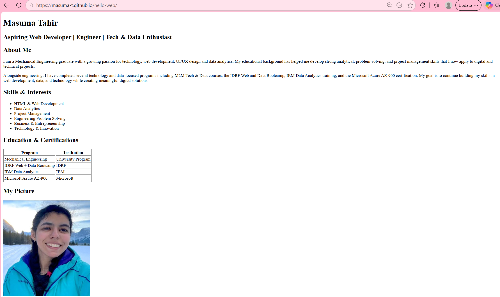

# Hello Web - Personal Portfolio

##  Project Title
Hello Web - Personal Portfolio 

---

##  Live Website
https://masuma-t.github.io/hello-web/

---

## Screenshot

---

## About the Project
This is my first personal portfolio website built using semantic HTML. It introduces my background, skills, education, and ways to connect with me online.

---

## Features
- Semantic HTML structure (`header`, `main`, `section`, `footer`)
- Personal bio and career goals
- Skills and interests list
- Profile image inclusion
- External links (GitHub, LinkedIn, Email)
- GitHub Pages deployment

---

## Reflection
During Week 1, this project helped me understand the fundamentals of HTML structure, semantic tags, and how websites are deployed using GitHub Pages. I also learned how version control works using Git and how meaningful commits help track progress in development. It gave me a strong foundation for building future web development projects.

For Week 2, I focused on improving the visual design of my portfolio using CSS. I chose the Poppins font because it provides a clean, modern, and professional appearance that improves readability. I used a blue-based color palette to create a professional and technology-focused look while maintaining strong contrast and accessibility.

I applied CSS variables to keep the design consistent and easier to maintain. The use of padding, margin, border-radius, and box shadows helped create clear content sections and improve visual hierarchy. I also implemented hover transitions on interactive elements to provide visual feedback and improve the user experience.

Through this project, I learned how CSS can transform a simple HTML page into a polished and professional website. I also gained experience using external stylesheets, CSS variables, typography, and responsive design principles.

For Week 3, I learned when to use Flexbox and CSS Grid. I used Flexbox for the navigation bar because it is ideal for arranging items in a single row and controlling alignment and spacing. I used CSS Grid for the Projects section because it provides a responsive two-dimensional layout that automatically adapts to different screen sizes using repeat(auto-fit, minmax()).

This assignment helped me understand how modern CSS layout tools can create responsive designs without relying on media queries.

---

## Technologies Used
- HTML5
- Git & GitHub
- GitHub Pages
