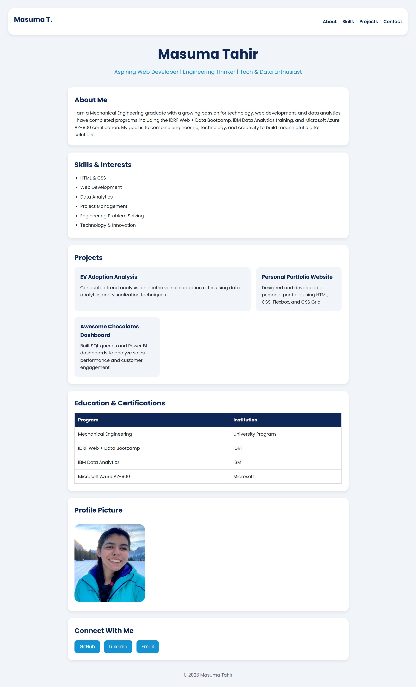
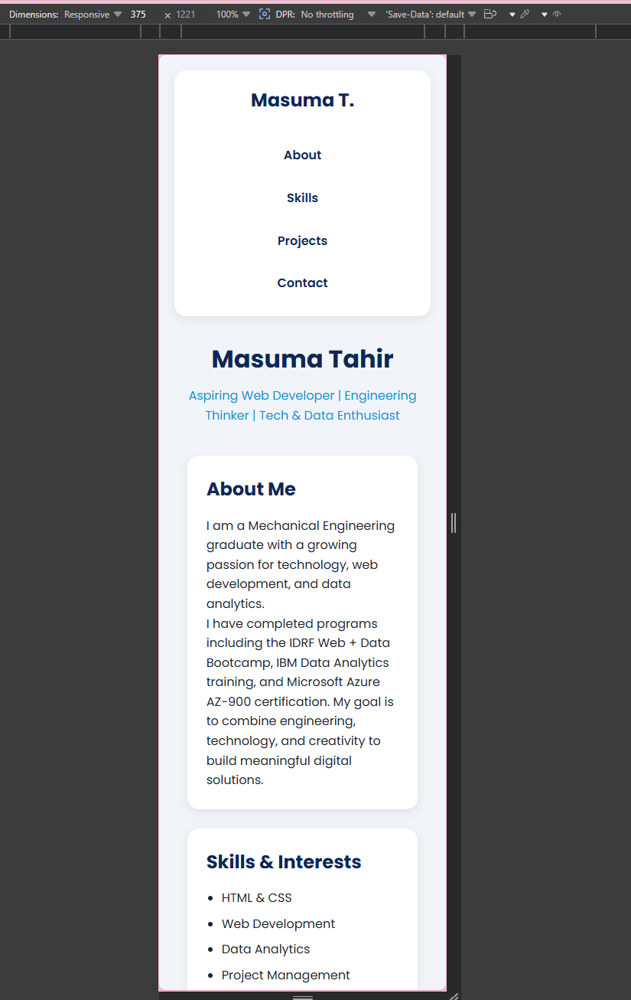
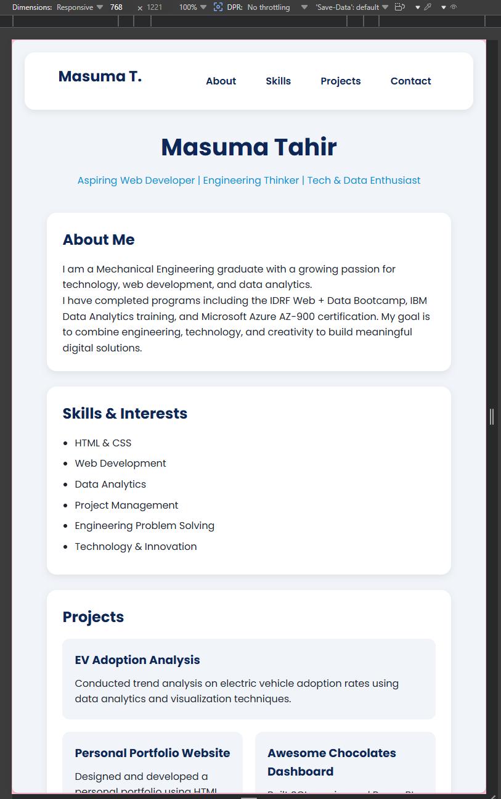
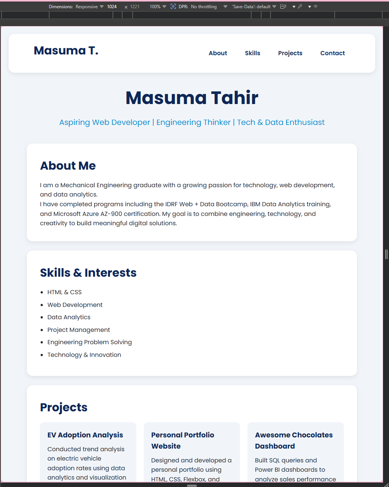
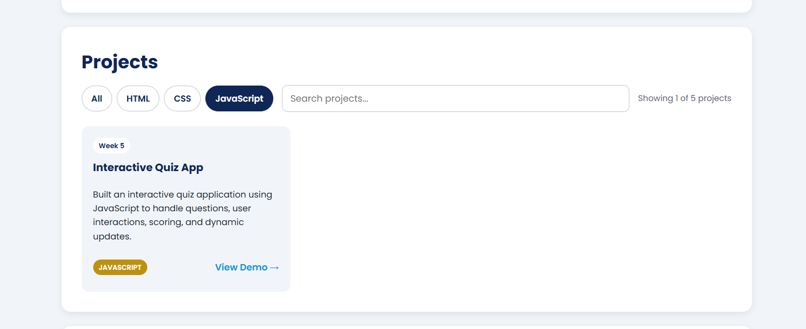
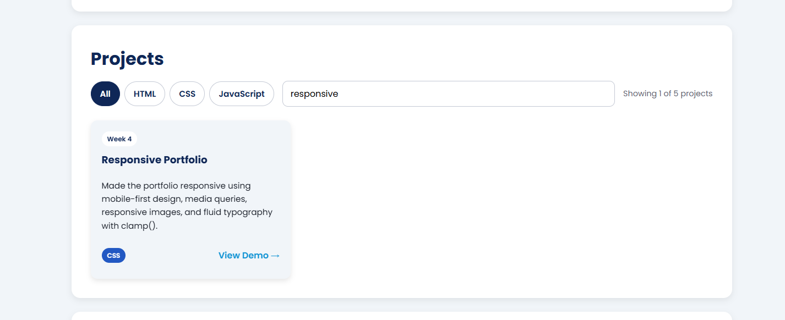
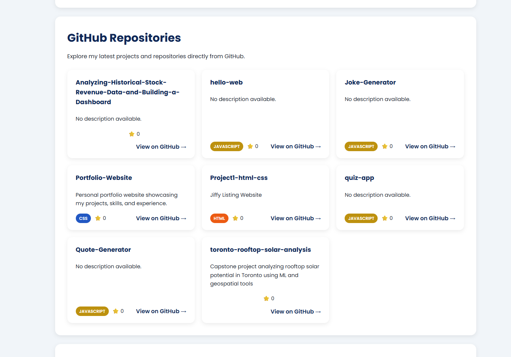

# Hello Web - Personal Portfolio

##  Project Title
Hello Web - Personal Portfolio 

---

##  Live Website
https://masuma-t.github.io/hello-web/

---

## Screenshot

---

## About the Project
This is my first personal portfolio website built using semantic HTML. It introduces my background, skills, education, and ways to connect with me online.

---

## Features
- Semantic HTML structure (`header`, `main`, `section`, `footer`)
- Personal bio and career goals
- Skills and interests list
- Profile image inclusion
- Flexbox was used for navigation and social links
- Grid was used for the Projects section because it handles  two-dimensional layouts well.
- External links (GitHub, LinkedIn, Email)
- GitHub Pages deployment

---

## Reflection
During Week 1, this project helped me understand the fundamentals of HTML structure, semantic tags, and how websites are deployed using GitHub Pages. I also learned how version control works using Git and how meaningful commits help track progress in development. It gave me a strong foundation for building future web development projects.

For Week 2, I focused on improving the visual design of my portfolio using CSS. I chose the Poppins font because it provides a clean, modern, and professional appearance that improves readability. I used a blue-based color palette to create a professional and technology-focused look while maintaining strong contrast and accessibility.

I applied CSS variables to keep the design consistent and easier to maintain. The use of padding, margin, border-radius, and box shadows helped create clear content sections and improve visual hierarchy. I also implemented hover transitions on interactive elements to provide visual feedback and improve the user experience.

Through this project, I learned how CSS can transform a simple HTML page into a polished and professional website. I also gained experience using external stylesheets, CSS variables, typography, and responsive design principles.

For Week 3, I learned when to use Flexbox and CSS Grid. I used Flexbox for the navigation bar because it is ideal for arranging items in a single row and controlling alignment and spacing. I used CSS Grid for the Projects section because it provides a responsive two-dimensional layout that automatically adapts to different screen sizes using repeat(auto-fit, minmax()).

This assignment helped me understand how modern CSS layout tools can create responsive designs without relying on media queries.

For Week 4, I focused on making my portfolio fully responsive using a mobile-first approach. I added the viewport meta tag, responsive images, a fluid content container, and media queries using minimum-width breakpoints.

The portfolio was tested at the required viewport sizes of 375px, 768px, and 1024px using Chrome DevTools Device Mode. The navigation adapts from a vertical layout on mobile to a horizontal layout on larger screens. The Projects section changes from one column on mobile, to two columns on tablets, and three columns on desktop.

I also used CSS `clamp()` for fluid typography so that headings and text can scale smoothly between different screen sizes. CSS custom properties were used for the color palette and reusable styling values.

### Responsive Design Testing

#### Mobile — 375px

#### Tablet — 768px

#### Desktop — 1024px

### Responsive Features

* Mobile-first CSS design
* Responsive navigation
* Responsive project grid
* Tablet breakpoint at 768px
* Desktop breakpoint at 1024px
* Fluid typography using `clamp()`
* Responsive images using `max-width: 100%`
* Fluid content container with a maximum width of 1200px
* Mobile-friendly 44px tap targets
* CSS custom properties for reusable colors and styling
* No horizontal scrolling across tested viewport sizes

For Week 6, I upgraded my portfolio from a static webpage into a dynamic and interactive application using vanilla JavaScript and DOM manipulation.

I created a JavaScript projects data array containing five projects completed during the course. Each project includes its title, technology, week number, description, and project link. The projects are rendered dynamically onto the portfolio using JavaScript template literals and DOM manipulation.

I also added interactive filtering and search functionality. Users can filter projects by HTML, CSS, or JavaScript, and the project list updates automatically based on the selected category. The search feature allows users to search for projects by title or description and updates the results as the user types.

I also implemented an Escape key feature that clears the search field and restores the project results. The results counter updates dynamically to show how many projects are currently displayed. Event delegation was also used on the project grid to detect project link interactions.

This assignment helped me understand how JavaScript can transform a static webpage into an interactive application. I learned how to work with arrays of objects, template literals, DOM elements, event listeners, filtering, and live search functionality.

I also learned how important it is to organize JavaScript separately from the HTML and CSS while connecting all three technologies together. Incorporating the Week 6 functionality directly into my existing portfolio helped me understand how new features can be added to an existing project without rebuilding the entire website.

### Week 6 Screenshots

#### Project Filter

The JavaScript filter displays only projects that use JavaScript.

#### Project Search

The search feature filters the projects based on the user's search term.

## Week 7 – GitHub API Integration

For Week 7, I connected my portfolio to the GitHub API using JavaScript's Fetch API and async/await. The GitHub Repositories section dynamically retrieves my public repositories from GitHub and displays them as repository cards.

The repository cards display the repository name, description, primary programming language, star count, and a link to the repository on GitHub. The application also handles repositories without descriptions or programming languages without displaying null values.

Because the repositories are fetched directly from the GitHub API, new public repositories can automatically appear on my portfolio without manually adding them to the HTML.

### GitHub API Screenshot

---

## Technologies Used

* HTML5
* CSS3
* CSS Flexbox
* CSS Grid
* CSS Media Queries
* CSS `clamp()`
* DOM Manipulation
* Event Listeners
* Template Literals
* Javascript
* Git & GitHub
* GitHub Pages
* Chrome DevTools

